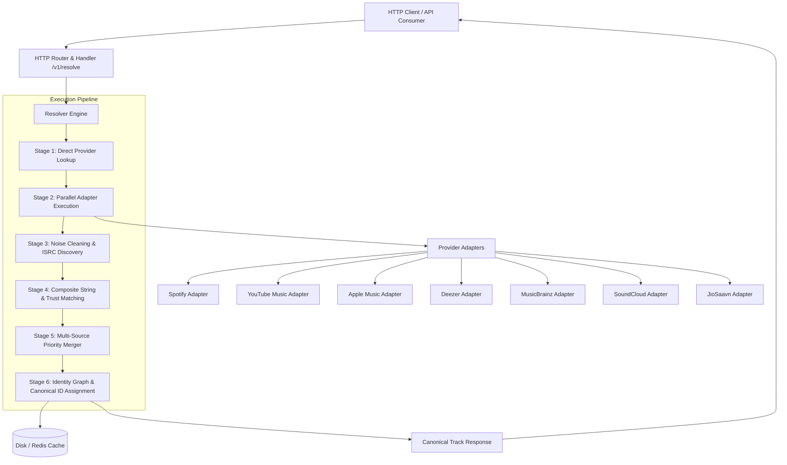

# 🎵 OMMR — Open Music Metadata Resolver

> **Self-hostable Go music metadata resolver with source-by-source extraction and guarded cross-platform matching.**

[](https://go.dev/)
[](LICENSE)
[](https://github.com/Wilooper/OpenMusicMetadataResolver-OMMR-/releases)
[](https://github.com/Wilooper/OpenMusicMetadataResolver-OMMR-/actions)
[](#no-api-keys-required)
[](docker-compose.yml)

---

## 📌 Why OMMR?

### The Problem
Music metadata across streaming services is heavily fragmented:
* A YouTube video ID (`x18b0D8sTwo`) cannot be directly mapped to Apple Music (`1534955145`), Deezer (`108990152`), or MusicBrainz (`b068febb...`).
* Streaming providers format artist and song titles inconsistently (e.g. `AP Dhillon - Topic`, `Excuses (Official Video)`, `Excuses (Remastered)`).
* Commercial metadata resolution APIs require expensive developer credentials, secret keys, or restrictive API quotas for every service.

### The OMMR Solution
OMMR accepts a platform identifier or artist and title and returns a canonical record with field provenance and identity confidence. Public paths require no keys; richer official catalog modes and some partner APIs require credentials and may have account restrictions. See [metadata fields and provider evidence](docs/METADATA_CATALOG.md).

### Private configuration

Configuration precedence is process environment (including explicitly empty
values), YAML configuration, env-file values, then built-in defaults. Spotify
official mode requires both client credentials. YouTube cookies must be a single
header value containing `SAPISID` or `__Secure-3PAPISID`; invalid configuration
fails at startup without echoing the cookie. Apple and Spotify credentialed
clients refuse HTTP redirects.

Copy `.env.example` to `.env`, fill only the credentials you have, run `chmod 600 .env`, and start with `OMMR_ENV_FILE=.env ./bin/ommr-server`. Alternatively copy `ommr.example.yaml` to `ommr.yaml`, run `chmod 600 ommr.yaml`, and set `OMMR_CONFIG_FILE=ommr.yaml`. Process environment overrides the file. Neither file is committed. Never put cookies or tokens in API URLs or logs. `OMMR_YTMUSIC_COOKIE_FILE` points to a private file containing a browser Cookie header; the optional cookie is used only on YouTube InnerTube calls. Apple uses an operator-generated **developer token** and storefront for the official catalog endpoint; the public iTunes lookup remains the keyless fallback. Spotify uses client credentials; current Spotify Development Mode requires the app owner to have Premium. Amazon Music V2 requires approved beta access. Optional credentialed modes have fixture tests, but live provider calls require your own authorized credentials.

---

## ✨ Key Features

* **🌐 Zero-Key Architecture**: Resolves metadata via unauthenticated public endpoints and web embeds across Spotify (dual-mode), YouTube Music (InnerTube), Apple Music, Deezer, MusicBrainz, SoundCloud, and JioSaavn — 7 providers, zero keys required.
* **🔗 6-Stage Cross-Platform Identity Pipeline**: Translates input IDs into cross-platform identifiers (`spotify`, `youtube`, `applemusic`, `deezer`, `soundcloud`, `jiosaavn`, `musicbrainz`, `isrc`).
* **🆔 Path-Independent Canonical Track IDs**: Generates deterministic, collision-resistant track identifiers (`ommr_track_<hash>`) that collapse the same recording to identical IDs regardless of query entry point.
* **📊 Multi-Source Metadata Merging**: Prioritizes higher-quality metadata fields across providers (e.g. MusicBrainz credits, Spotify genres, Apple Music cover art) with deduplicated source attribution.
* **🕵️ Source Transparency & Field Provenance**: Returns `metadata_sources`, `provider_status` diagnostics (latency, cached status, rejection reasons), and `field_sources` (attributing every field to its source provider).
* **🧠 Composite Matching & Calibrated Scores**: Combines Jaro-Winkler + Token Set Ratio composites, strict candidate acceptance (score threshold + artist gate), and provider trust coefficients (`MusicBrainz: 1.00`, `Apple: 0.95`, `Spotify: 0.95`, `Deezer: 0.90`, `JioSaavn: 0.85`, `YTMusic: 0.80`, `SoundCloud: 0.75`).
* **🎯 Structured Identity Verification**: Assigns `identity_status` (`verified`, `strong`, `probable`, `weak`) and `identity_reasons` (`isrc_match`, `musicbrainz_match`, `exact_title_artist_match`).
* **⚡ Dual-Tier Caching**: Sub-divided local disk cache (`raw/`, `normalized/`, `resolved/`) and Redis caching.
* **📦 Operations**: Includes Prometheus metrics (`/metrics`), request IDs, provider rate limiting, bulk resolution, and Docker Compose deployment. Credentialed integrations still require live validation with your accounts.

---

## 🏗️ Architecture Overview



---

## 🚀 Quick Start

### 1. Build and Run Binary

```bash
# Clone repository
git clone https://github.com/Wilooper/OpenMusicMetadataResolver-OMMR-.git
cd OpenMusicMetadataResolver-OMMR-

# Build server binary
go build -o bin/ommr-server.exe ./cmd/server

# Run server
./bin/ommr-server.exe
```

Server starts listening on `http://localhost:8080`.

### 2. Prebuilt Docker Container (GHCR)

```bash
# Pull and run prebuilt container from GitHub Container Registry
docker run -d \
  --name ommr-server \
  -p 8080:8080 \
  ghcr.io/wilooper/ommr:latest
```

### 3. Docker Compose (Recommended for Self-Hosting)

```bash
# Start OMMR with Redis cache via Docker Compose
docker compose up -d
```

Verify service readiness:

```bash
curl http://localhost:8080/v1/health
```

Output:
```json
{
  "status": "healthy",
  "version": "1.0.0",
  "uptime_seconds": 42,
  "cache_provider": "redis"
}
```

---

## 📡 API Usage & Examples

### Resolve by YouTube Video ID

```bash
curl "http://localhost:8080/v1/resolve?youtube_id=x18b0D8sTwo"
```

### Resolve by Artist + Song Title

```bash
curl "http://localhost:8080/v1/resolve?artist=Talwiinder&title=Tu"
```

### Resolve by SoundCloud Permalink

```bash
curl "http://localhost:8080/v1/resolve?soundcloud_id=m83/midnight-city"
```

### Lightweight Track Search

```bash
curl "http://localhost:8080/v1/search?q=boom%20shaka&page=1&limit=5"
```

---

## 📋 Example Response Payload (`/v1/resolve`)

> Note: The payload below is illustrative. Track/video IDs shown are example values and do not represent a specific real release.

```json
{
  "track": {
    "canonical_id": "ommr_track_2c15190166124384",
    "identity_status": "verified",
    "identity_reasons": [
      "isrc_match",
      "musicbrainz_match",
      "exact_title_artist_match"
    ],
    "title": "Tu",
    "artists": [
      { "name": "Talwiinder", "role": "main" }
    ],
    "album": {
      "title": "Tu - Single",
      "release_date": "2024-06-21"
    },
    "duration_ms": 218400,
    "release_date": "2024-06-21",
    "explicit": false,
    "isrc": "QZRP52317311",
    "genres": ["Punjabi Pop", "Indian Pop"],
    "credits": [
      { "name": "Talwiinder", "roles": ["Artist", "Composer"] }
    ],
    "images": [
      { "url": "https://is1-ssl.mzstatic.com/.../100x100bb.jpg", "width": 100, "height": 100, "type": "cover" },
      { "url": "https://is1-ssl.mzstatic.com/.../600x600bb.jpg", "width": 600, "height": 600, "type": "cover" }
    ],
    "ids": {
      "ytmusic": "FVNSACXFAy0",
      "applemusic": "1749982113",
      "musicbrainz": "400436a5-99fa-44d9-b51f-5c63be233454"
    },
    "identity_matches": [
      { "provider": "applemusic", "id": "1749982113", "confidence": 0.94, "method": "title_artist_duration" },
      { "provider": "musicbrainz", "id": "400436a5-99fa-44d9-b51f-5c63be233454", "confidence": 1.0, "method": "isrc" }
    ],
    "sources": ["ytmusic", "applemusic", "musicbrainz"],
    "field_sources": {
      "album": ["applemusic"],
      "artists": ["applemusic"],
      "credits": ["musicbrainz"],
      "duration": ["applemusic"],
      "genres": ["applemusic"],
      "images": ["ytmusic", "applemusic"],
      "isrc": ["musicbrainz"],
      "release_date": ["applemusic"],
      "title": ["applemusic"]
    },
    "match_score": 0.96,
    "match_breakdown": {
      "title": 1.0,
      "artists": 1.0,
      "album": 0.88,
      "duration": 1.0,
      "release_date": 1.0,
      "isrc": 1.0
    },
    "confidence": {
      "level": "exact",
      "score": 0.96
    },
    "completeness": 1.0
  },
  "metadata_sources": ["ytmusic", "applemusic", "musicbrainz"],
  "provider_status": [
    { "name": "applemusic", "success": true, "matched": true, "contributed": true, "cached": false, "latency_ms": 61, "version": "applemusic-v1" },
    { "name": "ytmusic", "success": true, "matched": true, "contributed": true, "cached": false, "latency_ms": 153, "version": "ytmusic-innertube-v1" },
    { "name": "musicbrainz", "success": true, "matched": true, "contributed": true, "cached": false, "latency_ms": 340, "version": "musicbrainz-v2" },
    { "name": "deezer", "success": true, "matched": false, "contributed": false, "cached": false, "latency_ms": 286, "rejection_reason": "no_results", "version": "deezer-v1" },
    { "name": "spotify", "success": true, "matched": false, "contributed": false, "cached": false, "latency_ms": 0, "rejection_reason": "no_results", "version": "spotify-web-v2" }
  ],
  "resolution_strategy": {
    "input_type": "youtube_id",
    "primary_source": "ytmusic",
    "cross_resolved": true
  },
  "resolver_stats": {
    "providers_queried": 7,
    "providers_matched": 3,
    "providers_contributed": 3,
    "candidates_evaluated": 6
  }
}
```

---

## ⚙️ Configuration

OMMR is configured via environment variables or a `.env` file:

| Variable | Type | Default | Description |
| --- | --- | --- | --- |
| `PORT` | Integer | `8080` | HTTP server listening port |
| `CACHE_PROVIDER` | String | `disk` | Caching backend (`disk` or `redis`) |
| `CACHE_DIR` | String | `./cache` | Storage directory for disk cache |
| `REDIS_URL` | String | `redis://localhost:6379/0` | Redis connection URL |
| `CACHE_TTL` | Duration | `168h` (7 days) | Cache expiration TTL |
| `RATE_LIMIT_RPS` | Float | `100.0` | Global API rate limit in requests/sec |
| `PROVIDER_TIMEOUT` | Duration | `5s` | Timeout per provider HTTP request |
| `BULK_MAX_ITEMS` | Integer | `100` | Maximum queries allowed in `POST /v1/bulk` |
| `BULK_WORKERS` | Integer | `10` | Worker pool concurrency for bulk resolution |
| `SPOTIFY_CLIENT_ID` | String | *(empty)* | Optional: Spotify official Web API client ID |
| `SPOTIFY_CLIENT_SECRET` | String | *(empty)* | Optional: Spotify official Web API client secret |

---

## 🗄️ Caching Architecture

OMMR implements two interchangeable caching providers implementing the `cache.Cache` interface:

* **Disk Cache (`internal/cache/disk/`)**: Stores entries in sub-directories (`raw/{provider}/`, `normalized/`, `resolved/`) for inspection and zero-dependency deployments.
* **Redis Cache (`internal/cache/redis/`)**: Uses `go-redis/v9` with automatic key TTLs and connection pooling for high-concurrency production deployments.

Bypass cache per request using `GET /v1/resolve?...&bypass_cache=true`.

---

## 📚 Technical Documentation Index

Detailed technical specifications are located in the `docs/` directory:

* 📖 **[API Specification](docs/API_SPEC.md)** — Complete REST endpoint documentation and DTO schemas.
* 🏗️ **[Architecture Guide](docs/ARCHITECTURE.md)** — Clean architecture design, 6-stage pipeline, and concurrency models.
* 📐 **[Domain Schema](docs/SCHEMA.md)** — In-depth domain model definitions (`Track`, `IdentityGraph`, `IdentityMatch`).
* 🎯 **[Matching Engine](docs/MATCHING_ENGINE.md)** — String similarity algorithms, provider trust weights, and scoring matrices.
* 💾 **[Caching System](docs/CACHING.md)** — Disk and Redis caching implementations and TTL strategies.
* 🔑 **[Identity Engine](docs/IDENTITY_ENGINE.md)** — Recording hash generation, identity verification rules, and graph storage.
* 🔌 **[Provider Adapters](docs/PROVIDERS.md)** — Zero-key provider integration details, Lucene escaping, and fallback strategies.
* 🤝 **[Contributing Guide](docs/CONTRIBUTING.md)** — Developer setup, Go conventions, skill library integration, and PR rules.
* ❓ **[Frequently Asked Questions](docs/FAQ.md)** — Common questions regarding zero-key operation, rate limiting, and accuracy.

---

## 🗺️ Roadmap

### Version 1.0 (Current)
- [x] Zero-key provider adapters (Spotify dual-mode, YouTube Music InnerTube, Apple Music, Deezer, MusicBrainz, SoundCloud, JioSaavn)
- [x] 6-stage cross-platform ID discovery pipeline
- [x] Path-independent canonical track IDs (`ommr_track_<hash>`)
- [x] Calibrated composite matching engine, strict candidate acceptance & provider trust weights
- [x] Extended canonical schema (ISWC, preview URLs, track/disc numbers, labels, barcodes, copyrights, play counts)
- [x] Source attribution & provenance diagnostics (`field_sources`, `provider_status`, `resolver_stats`)
- [x] Disk and Redis dual caching backends

### Future Releases
- [ ] **v1.1**: Expanded lyrics metadata extraction & sync timecodes
- [ ] **v1.2**: Canonical Artist Identity Resolver (`ommr_artist_<hash>`)
- [ ] **v1.3**: Canonical Album & Release Identity Resolver (`ommr_album_<hash>`)
- [ ] **v1.4**: Playlist cross-platform conversion endpoint (`POST /v1/playlist/convert`)
- [ ] **v2.0**: GraphQL API query interface & automatic OpenAPI client SDK generation

---

## 👥 Contributing

Contributions are warmly welcome! Please read [docs/CONTRIBUTING.md](docs/CONTRIBUTING.md) for details on our code style, local skill library integration (`cc-skills-golang`), and pull request submission process.

---

## 📄 License

OMMR is open-source software licensed under the [MIT License](LICENSE).

hi
