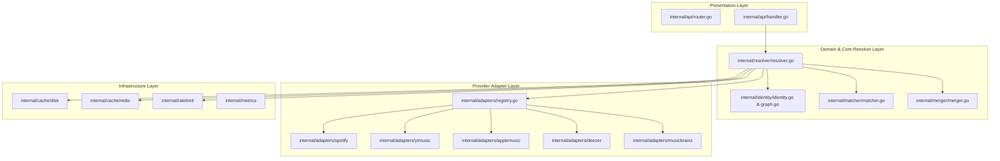
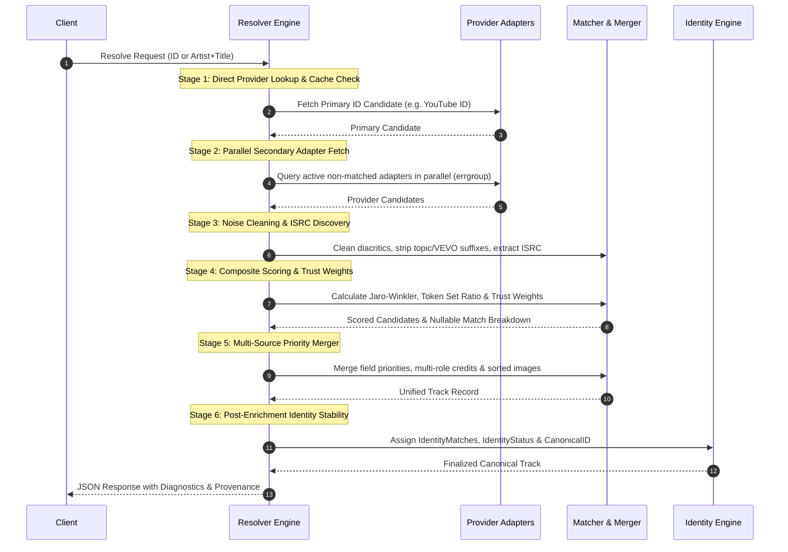

# OMMR Architecture Guide

## Overview

Open Music Metadata Resolver (OMMR) is designed following **Clean Architecture principles**, separating domain models, application use cases (Resolver Engine), provider adapters, and infrastructure primitives (Cache, Rate Limiters, Metrics).

---

## Architecture Layers

---

## 6-Stage Identity Resolution Pipeline

Every resolution request processed by `Resolver.Resolve()` executes through a strict 6-stage pipeline:

---

## Concurrency & Rate Limiting Model

1. **Parallel Provider Execution**: Provider queries run concurrently using `golang.org/x/sync/errgroup`. A failure in one provider (e.g., MusicBrainz 503) does not abort other providers; errors are recorded in `provider_status[].error`.
2. **Provider-Specific Rate Limiting**: `internal/ratelimit/provider_limiter.go` maintains per-provider token buckets to prevent HTTP 429 rate limit bans from third-party services.
3. **Bulk Resolution Concurrency**: `POST /v1/bulk` processes array queries across a bounded worker pool controlled by `config.BulkWorkers` (default: 10 workers).
