# OMMR Architecture Guide

## Overview

Open Music Metadata Resolver (OMMR) is designed following **Clean Architecture principles**, separating domain models, application use cases (Resolver Engine), provider adapters, and infrastructure primitives (Cache, Rate Limiters, Metrics).

---

## Architecture Layers

```mermaid
graph TD
    subgraph Presentation Layer
        Router[internal/api/router.go]
        Handler[internal/api/handler.go]
    end

    subgraph Domain & Core Resolver Layer
        Resolver[internal/resolver/resolver.go]
        Identity[internal/identity/identity.go & graph.go]
        Matcher[internal/matcher/matcher.go]
        Merger[internal/merger/merger.go]
    end

    subgraph Provider Adapter Layer
        Registry[internal/adapters/registry.go]
        Spotify[internal/adapters/spotify]
        YTMusic[internal/adapters/ytmusic]
        Apple[internal/adapters/applemusic]
        Deezer[internal/adapters/deezer]
        MusicBrainz[internal/adapters/musicbrainz]
        SoundCloud[internal/adapters/soundcloud]
        JioSaavn[internal/adapters/jiosaavn]
    end

    subgraph Infrastructure Layer
        DiskCache[internal/cache/disk]
        RedisCache[internal/cache/redis]
        Limiter[internal/ratelimit]
        Metrics[internal/metrics]
    end

    Handler --> Resolver
    Resolver --> Registry
    Resolver --> Matcher
    Resolver --> Merger
    Resolver --> Identity
    Registry --> Spotify
    Registry --> YTMusic
    Registry --> Apple
    Registry --> Deezer
    Registry --> MusicBrainz
    Registry --> SoundCloud
    Registry --> JioSaavn
    Resolver --> DiskCache
    Resolver --> RedisCache
    Resolver --> Limiter
```



---

## 6-Stage Identity Resolution Pipeline

Every resolution request processed by `Resolver.Resolve()` executes through a strict 6-stage pipeline:

```mermaid
sequenceDiagram
    autonumber
    participant C as Client
    participant R as Resolver Engine
    participant P as Provider Adapters
    participant M as Matcher & Merger
    participant I as Identity Engine

    C->>R: Resolve Request (ID or Artist+Title)
    Note over R: Stage 1: Direct Provider Lookup & Cache Check
    R->>P: Fetch Primary ID Candidate (e.g. YouTube ID)
    P-->>R: Primary Candidate
    Note over R: Stage 2: Parallel Secondary Adapter Fetch
    R->>P: Query active non-matched adapters in parallel (errgroup)
    P-->>R: Provider Candidates
    Note over R: Stage 3: Noise Cleaning & ISRC Discovery
    R->>M: Clean diacritics, strip topic/VEVO suffixes, extract ISRC
    Note over R: Stage 4: Composite Scoring & Trust Weights
    R->>M: Calculate Jaro-Winkler, Token Set Ratio & Trust Weights
    M-->>R: Scored Candidates & Nullable Match Breakdown
    Note over R: Stage 4b: Strict Candidate Acceptance
    R->>R: Reject below-threshold + artist-gate violations; no forced merge
    Note over R: Stage 5: Multi-Source Priority Merger
    R->>M: Merge field priorities, multi-role credits & sorted images
    M-->>R: Unified Track Record
    Note over R: Stage 6: Post-Enrichment Identity Stability
    R->>I: Assign IdentityMatches, IdentityStatus & CanonicalID
    I-->>R: Finalized Canonical Track
    R-->>C: JSON Response with Diagnostics & Provenance
```

---

## Concurrency & Rate Limiting Model

1. **Parallel Provider Execution**: Provider queries run concurrently using `golang.org/x/sync/errgroup`. A failure in one provider (e.g., MusicBrainz 503) does not abort other providers; errors are recorded in `provider_status[].error`.
2. **Provider-Specific Rate Limiting**: `internal/ratelimit/provider_limiter.go` maintains per-provider token buckets to prevent HTTP 429 rate limit bans from third-party services.
3. **Bulk Resolution Concurrency**: `POST /v1/bulk` processes array queries across a bounded worker pool controlled by `config.BulkWorkers` (default: 10 workers).

---

## Strict Candidate Acceptance (`internal/resolver/resolver.go`)

Candidates are not force-merged. Acceptance gates prevent wrong track/video IDs and wrong metadata from polluting results:

1. **Score threshold**: Candidates with `match_score < 0.40` are rejected (`rejectThreshold`).
2. **Artist gate**: When the query carries an explicit artist, candidates whose primary-artist similarity is `< 0.45` are rejected even if their combined score passes. This stops title-only matches on a different artist (e.g. another "Get Lucky") from leaking their IDs/metadata.
3. **No forced merge**: Sub-threshold candidates are never dumped into the result. If nothing clears the threshold, only the single best candidate is surfaced (guarded by an absolute minimum of `0.30`), or nothing is returned.
4. **Per-provider status**: A provider is marked `matched: true` only when at least one of its candidates was accepted; mixed accepted/rejected candidate pools resolve to the accepted outcome.

---

## Spotify Dual-Mode Operation

The Spotify adapter (`internal/adapters/spotify/`) operates in two modes:

1. **Official (key-based, optional)**: If `OMMR_SPOTIFY_CLIENT_ID` and `OMMR_SPOTIFY_CLIENT_SECRET` are set, it uses the OAuth client-credentials flow and the Web API.
2. **Zero-key (default)**: Fetches an anonymous web-player token from `https://open.spotify.com/get_access_token` and calls the Web API; falls back to embed `__NEXT_DATA__` scraping and then oEmbed if the anonymous token is unavailable.
