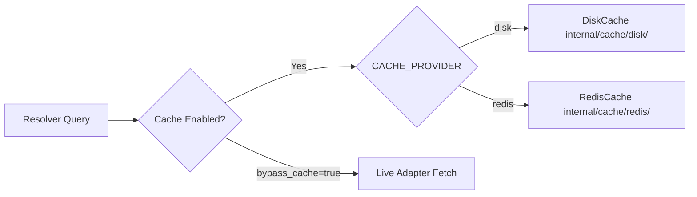

# OMMR Dual-Tier Caching Architecture

OMMR provides high-performance metadata caching to minimize latency and prevent third-party rate limit throttling.

---

## Supported Caching Backends

### 1. Disk Cache (`internal/cache/disk/disk.go`)
- **Default for local development and self-hosted environments.**
- Stores entries in a subdivided directory layout:
  - `./cache/raw/{provider}/`: Unprocessed provider HTTP API JSON payloads.
  - `./cache/normalized/`: Normalized track candidate DTOs.
  - `./cache/resolved/`: Final resolved canonical track responses.
- Atomic file write operations ensure zero data corruption during concurrent writes.

### 2. Redis Cache (`internal/cache/redis/redis.go`)
- **Recommended for production multi-instance deployments.**
- Built using `go-redis/v9` with automatic key TTLs and connection pooling.
- Configured via `REDIS_URL` (e.g. `redis://localhost:6379/0`).

---

## TTL Management & Cache Bypass

- **Default TTL**: Configured via `CACHE_TTL` (default: `168h` / 7 days).
- **Cache Bypass**: Append `bypass_cache=true` to any `/v1/resolve` request to bypass cache reads and force live provider fetches.
