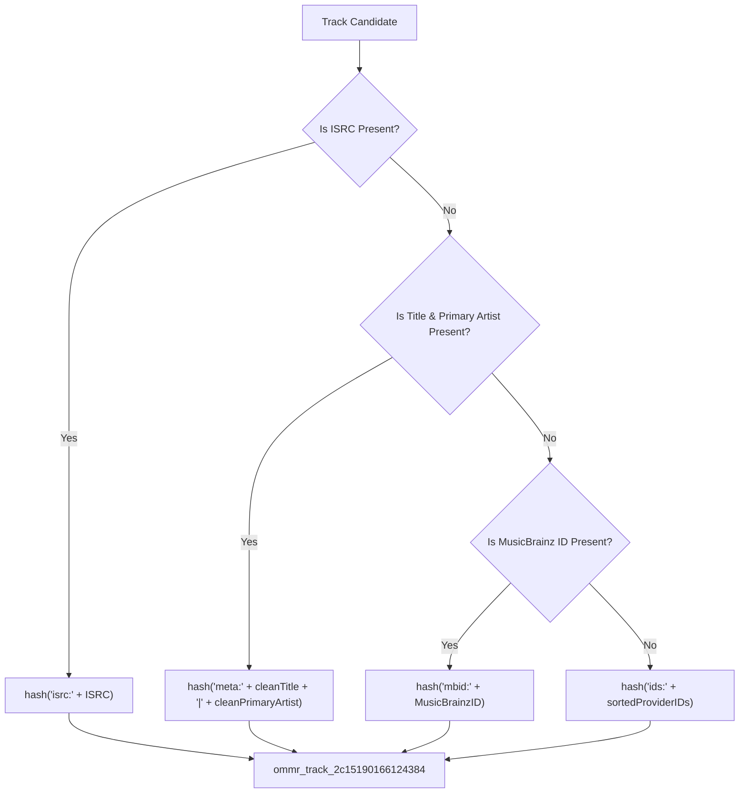

# OMMR Identity Engine & Graph Storage

The **Identity Engine** (`internal/identity/`) resolves cross-platform identities and generates stable, recording-based canonical track IDs. The `IdentityGraph` (`internal/identity/graph.go`) maps a canonical track to platform IDs for `spotify`, `youtube` (`ytmusic`), `applemusic`, `deezer`, `soundcloud`, `jiosaavn`, and `musicbrainz`.

---

## Recording-Based Canonical ID Hierarchy

Canonical IDs follow the format `ommr_track_<16-char-hex>`.

The ID generation algorithm evaluates metadata in a strict hierarchy:

### Path Independence
Using `meta:cleanTitle|cleanPrimaryArtist` as the primary recording seed guarantees that resolving a track via **YouTube Video ID**, **Spotify Track ID**, or **Artist + Song Title** produces the **exact same canonical_id** (`ommr_track_2c15190166124384`).

---

## Identity Status Classification (`identity_status`)

| Identity Status | Criteria | Description |
| --- | --- | --- |
| `verified` | `score >= 0.85` AND (ISRC matched across 2+ providers OR verified MusicBrainz ID + ISRC) | Highest confidence identity match |
| `strong` | `score >= 0.90` with multi-provider ID consensus | Strong multi-provider metadata agreement |
| `probable` | `0.75 <= score < 0.90` | Probable match |
| `weak` | `score < 0.75` | Candidate matched below standard threshold |

---

## Identity Reasons Diagnostics (`identity_reasons`)

The `identity_reasons` array details why a specific identity status was assigned:
* `"isrc_match"`: Matched via International Standard Recording Code.
* `"musicbrainz_match"`: Verified against MusicBrainz community database.
* `"exact_title_artist_match"`: Title and primary artist matched with score $\ge 0.90$.
* `"multi_provider_isrc_consensus"`: Confirmed across 2+ distinct streaming providers.
